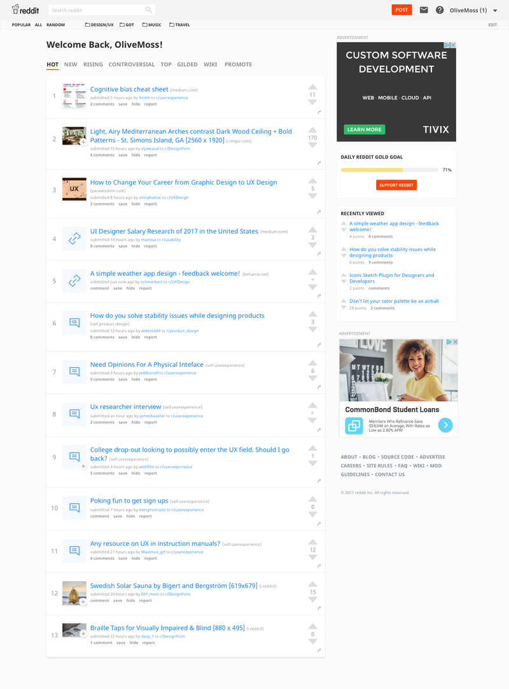

# Examples of Web / Apps with Bad UI
Name: Yolanda Hertita Pratama 
NRP: 05111640000052

## Outline
- [Snapchat](#1-snapchat)
- [WhatsApp](#2-whatsapp)
- [Reddit (web)](#3-reddit-web)

## 1. Snapchat
Snapchat is a mobile application used to share photos, videos, text, and drawings. It has become popular in a very short space of time, especially with young people. Snapchat was developed by Evan Spiegel and Bobby Murphy, two Stanford University students. 

In my opinion, here is one of reasons why Snapchat has bad UI:

### Disappearing Messages
When you're trying to have conversations, the messages will disappear from the recipient’s phone after being opened. It's not a bug, but it's a feature! 

I think it will be problematic if users forgot what were they talking about.

#### Suggestions
- Remove auto disappearing messages feature 
  Users can manually delete the message if they didn't want to keep that message by pressing the delete button.

#### Demo
((soon))

## 2. WhatsApp
WhatsApp Messenger is a cross-platform instant messaging application used to exchange text, image, video and audio messages. It is popular with teenagers and adults because of features like group chatting, voice messages and location sharing. 

Here is one of my experiences when using WhatsApp Messenger. 

### Messages can still be seen after deleted
When I'm in the conversation with a group of people, I realized that there is a mistake with the message that have been deleted.

You can still see messages that have been "Deleted For Everyone" on WhatsApp when someone has replied it before. It's not only you can see it, but everyone in the group can see that deleted messages.

#### Suggestions
- Replace the deleted message intended by someone's reply with words like "Message unavailable".

Because when the user has been clicking the "Deleted For Everyone" button, it means the user didn't want that message appears on the other users, maybe because it's an embarrassing or inappropriate message. 

#### Demo

## 3. Reddit (Web)
Reddit is a social news and entertainment website where registered users submit content in the form of either a link or a text ("self") post. Other users then vote the submission "up" or "down", which is used to rank the post and determine its position on the site's pages and front page. It can be opened via browser or mobile applications but in this assignment, I will talk about the web.

### The font size is too small
After you sign in you will be directed into the homepage, and you will realize that the font size is too small to read on your computer. Besides it looks like all the component is full of text, there's lack of icon or component to help us navigating.

Here is how the homepage looks like

#### Suggestions
- Change the font size or substitute navigator text with suitable icon.
- Redesigning the layout

Below is an example how Reddit should look

credit: https://www.tivix.com/blog/redesigning-reddit

#### Demo

## Thanks to
Thanks to Ferdinand, Dandy, Nurlita, and Fata